# Configuring Kubernetes for container orchestration

## There are several ways to create a Kubernetes cluster:

- Using a managed Kubernetes service
  like [Google Kubernetes Service (GKE)](https://cloud.google.com/kubernetes-engine/), [Azure Kubernetes Service (AKS)](https://docs.microsoft.com/en-us/azure/aks/),
  or [Amazon Elastic Kubernetes Service (EKS)](https://aws.amazon.com/eks/)
- Installing Kubernetes yourself on cloud or on-premises infrastructure with a Kubernetes installation tool like kubeadm
  or kops.

## Creating a local Kubernetes cluster

- Creating a Kubernetes cluster on your local machine with a tool
  like [Minikube](https://kubernetes.io/docs/setup/learning-environment/minikube/), or [MicroK8s](https://microk8s.io/)

## In this section, you are going to use Minikube.

Minikube creates a single-node Kubernetes cluster running in a virtual machine.

> A Minikube cluster is only intended for testing purposes, not for production. Later in this course, you will create an
> Amazon EKS cluster, which is suited for production.

## Before you install Minikube, you have to install kubectl.

kubectl is the primary Kubernetes CLI — you use it for all interactions with a Kubernetes cluster, no matter how the
cluster was created.

> ### If you're on Windows, you can [follow the handy guide on how to install Minikube on Windows.](https://kubernetes.io/docs/tasks/tools/install-kubectl-windows/)

### For Mac, you can follow below:

#### 1. Install kubectl binary with curl on macOS

```shell
curl -LO "https://dl.k8s.io/release/$(curl -L -s https://dl.k8s.io/release/stable.txt)/bin/darwin/amd64/kubectl" 
```

> #### Note:
>To download a specific version, replace the $(curl -L -s https://dl.k8s.io/release/stable.txt) portion of the command
> with the specific version.
>
>For example, to download version v1.26.0 on Intel macOS, type:
>
>```shell
>curl -LO "https://dl.k8s.io/release/v1.26.0/bin/darwin/amd64/kubectl"
>```
>And for macOS on Apple Silicon, type:
>```shell
>curl -LO "https://dl.k8s.io/release/v1.26.0/bin/darwin/arm64/kubectl"
>```

#### 2. Validate the binary (optional)

Download the kubectl checksum file:

```shell
   curl -LO "https://dl.k8s.io/release/$(curl -L -s https://dl.k8s.io/release/stable.txt)/bin/darwin/amd64/kubectl.sha256"
```

Validate the kubectl binary against the checksum file:

```shell
echo "$(cat kubectl.sha256)  kubectl" | shasum -a 256 --check
```

> If valid, the output is:
>
>``` kubectl: OK ```
>
>If the check fails, shasum exits with nonzero status and prints output similar to:
>
>```
>kubectl: FAILED 
>shasum: WARNING: 1 computed checksum did NOT match.
>```
>
>**Note**: Download the same version of the binary and checksum.

#### 3. Make the kubectl binary executable.

```shell
chmod +x ./kubectl
```

#### 4. Move the kubectl binary to a file location on your system PATH.

```shell
sudo mv ./kubectl /usr/local/bin/kubectl
sudo chown root: /usr/local/bin/kubectl
```

> **Note:** Make sure /usr/local/bin is in your PATH environment variable.

#### 5. Test to ensure the version you installed is up-to-date:

```shell
kubectl version --client
```

Or use this for detailed view of version:

```shell
kubectl version --client --output=yaml
```

#### 6. After installing the plugin, clean up the installation files:

```shell
rm kubectl kubectl.sha256
```

## ```kubectl``` Install is complete.

## Now let's install Minikube [official documentation](https://minikube.sigs.k8s.io/docs/start/).

#### 1. To install the latest minikube stable release on x86-64 macOS using binary download:

```shell
curl -LO https://storage.googleapis.com/minikube/releases/latest/minikube-darwin-amd64 &&
sudo install minikube-darwin-amd64 /usr/local/bin/minikube
```

#### 2. Start your cluster

From a terminal with administrator access (but not logged in as root), run:

```shell
minikube start
```

> If minikube fails to start, see the drivers page for help setting up a compatible container or virtual-machine
> manager.

#### 3. Interact with your cluster

```shell
kubectl get po -A
```

#### 4. For Interactive Dashboard

~~~shell
minikube dashboard
~~~

#### 5. Manage your cluster (Optional)

Pause Kubernetes without impacting deployed applications:

~~~shell
minikube pause
~~~

Unpause a paused instance:

~~~shell
minikube unpause
~~~

Halt the cluster:

~~~shell
minikube stop
~~~

Change the default memory limit (requires a restart):

~~~shell
minikube config set memory 9001
~~~

Browse the catalog of easily installed Kubernetes services:

~~~shell
minikube addons list
~~~

Create a second cluster running an older Kubernetes release:

~~~shell
minikube start -p aged --kubernetes-version=v1.16.1
~~~

Delete all the minikube clusters:

~~~shell
minikube delete --all 
~~~

Load a local Docker image:

~~~shell
minikube image load neerazz/javasamples:latest
~~~

#### Have a look at [The minikube handbook](https://minikube.sigs.k8s.io/docs/handbook/) for more detailed explanation.

## ```minikube``` Install is complete.

# Kubernetes resources

### Kubernetes has a declarative interface.

In other words, you describe how you want the deployment of your application to look like, and Kubernetes figures out
the necessary steps to reach this state.

The "language" that you use to communicate with Kubernetes consists of so-called Kubernetes resources.

There are many Kubernetes resources — each is responsible for a specific aspect of your application.

> You can find the full list of Kubernetes resources in
> the [Kubernetes API reference](https://kubernetes.io/docs/reference/generated/kubernetes-api/v1.20/).

Kubernetes' resources are defined in YAML files and submitted to the cluster through the Kubernetes HTTP API.

> Kubernetes' resource definitions are also sometimes called "**resource manifests**" or "**resource configurations**".

As soon as Kubernetes receives your resource definitions, it takes the necessary steps to reach the target state.

Similarly, to query the state of your applications, you retrieve Kubernetes resources through the Kubernetes HTTP API.

In practice, you do all these interactions with _**kubectl**_ - your primary client for the Kubernetes API.

In the remainder of this section, you will define a set of Kubernetes resources that describe
your [JavaSample application](https://github.com/neerazz/javasamples/tree/spring_boot_with_docker_k8), and in the end,
you will submit them to your
Kubernetes cluster.

The resources that you will use are
the [Deployment](https://kubernetes.io/docs/reference/generated/kubernetes-api/v1.20/#deployment-v1-apps) and
the [Service](https://kubernetes.io/docs/reference/generated/kubernetes-api/v1.20/#service-v1-core).

Let's start with the Deployment.

# Defining a Deployment

## First of all, create a folder named kube in your application directory:

~~~shell
mkdir kube
~~~

The purpose of this folder is to hold all the Kubernetes YAML files that you will create.

> It's
> a [best practice](https://kubernetes.io/docs/concepts/cluster-administration/manage-deployment/#organizing-resource-configurations)
> to group all resource definitions for an application in the same folder because this allows to submit them to the
> cluster with a single command.

- The first Kubernetes resource is
  a [Deployment](https://kubernetes.io/docs/reference/generated/kubernetes-api/v1.20/#deployment-v1-apps)
  - A Deployment creates and runs
    your [JavaSample application](https://github.com/neerazz/javasamples/tree/spring_boot_with_docker_k8) containers and
    keeps them alive.
  - [Here is the definition of a Deployment](kube/deployment.yaml).
- Next resource that you need
  is  [Service](https://kubernetes.io/docs/reference/generated/kubernetes-api/v1.20/#service-v1-core).
    - To expose your [JavaSample application](https://github.com/neerazz/javasamples/tree/spring_boot_with_docker_k8)
      you
      need Service.
    - [Here is the definition of a Service](kube/service.yaml).
    - 
- #### Submit your resource definitions to Kubernetes with the following command
    - ~~~shell
    kubectl apply -f kube/postgres_singlefile.yaml
    ~~~ 
    - **Note:** _This command submits all the YAML files in the kube directory to Kubernetes._
    - > The `-f` flag accepts either a single filename or a directory. In the latter case, all YAML files in the
      directory
      are submitted.
      ~~~shell
      kubectl apply -f kube
      ~~~ 
    - **Note:** _This command submits all the YAML files in the kube directory to Kubernetes._
    - > The `-f` flag accepts either a single filename or a directory. In the latter case, all YAML files in the
      directory
      are submitted.
    - ~~~shell
    kubectl apply -f kube 
    ~~~ 
    - **Note:** _This command submits all the YAML files in the kube directory to Kubernetes._
    - > The `-f` flag accepts either a single filename or a directory. In the latter case, all YAML files in the
      directory
      are submitted.

> **Note:** You can watch the application either through minikube dashboard, or using kubectl commands.

- #### You can now access your application through the `javasamples` Service. In Minikube, a Service can be accessed with the following command:

```shell
minikube service javasamples --url
```

- This command should print the URL of `javasamples` Service.

### Scaling your application

#### Kubernetes makes it very easy to increase the number of replicas to 2 or more:

```shell
kubectl scale --replicas=2 deployment/javasamples
```

#### You can watch how a new Pod is created with:

```shell
kubectl get pods -l app=javasamples --watch
```

> The `-l` flag restricts the output to only those Pods with an app=javasamples label.

### References:

- #### [Installing Kafka Docker on Kubernetes](https://dzone.com/articles/ultimate-guide-to-installing-kafka-docker-on-kuber)